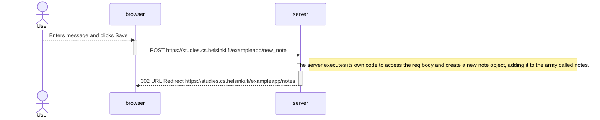

```mermaid
sequenceDiagram

actor User
participant browser
participant server

User-->>browser: Enters message and clicks Save
activate browser
browser->>server: POST https://studies.cs.helsinki.fi/exampleapp/new_note
deactivate browser

Note right of server: The server executes its own code to access the req.body and create a new note object, adding it to the array called notes.

activate server
server-->>browser: 302 URL Redirect https://studies.cs.helsinki.fi/exampleapp/notes
deactivate server

```