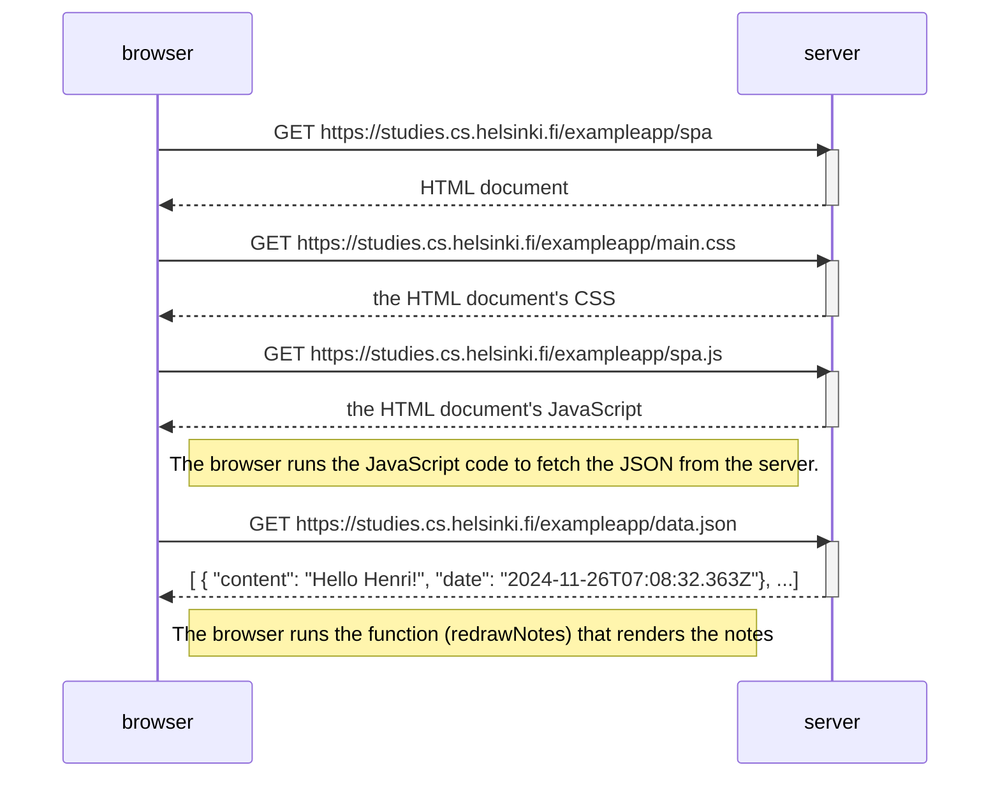

```mermaid
sequenceDiagram

participant browser
participant server

browser->>server: GET https://studies.cs.helsinki.fi/exampleapp/spa
activate server
server-->>browser: HTML document
deactivate server

browser->>server: GET https://studies.cs.helsinki.fi/exampleapp/main.css
activate server
server-->>browser: the HTML document's CSS
deactivate server

browser->>server: GET https://studies.cs.helsinki.fi/exampleapp/spa.js
activate server
server-->>browser: the HTML document's JavaScript
deactivate server

Note right of browser: The browser runs the JavaScript code to fetch the JSON from the server.

browser->>server: GET https://studies.cs.helsinki.fi/exampleapp/data.json
activate server
server-->>browser: [ { "content": "Hello Henri!", "date": "2024-11-26T07:08:32.363Z"}, ...]
deactivate server

Note right of browser: The browser runs the function (redrawNotes) that renders the notes
```