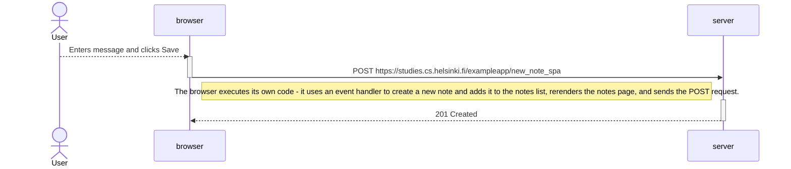

```mermaid
sequenceDiagram

actor User
participant browser
participant server

User-->>browser: Enters message and clicks Save
activate browser
browser->>server: POST https://studies.cs.helsinki.fi/exampleapp/new_note_spa
deactivate browser

Note right of browser: The browser executes its own code - it uses an event handler to create a new note and adds it to the notes list, rerenders the notes page, and sends the POST request.

activate server
server-->>browser: 201 Created
deactivate server

```